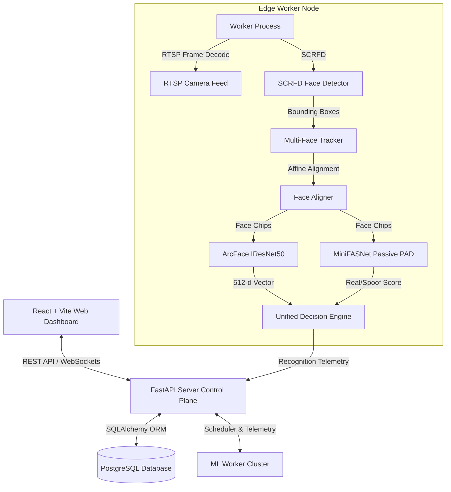

# AutoRoll Final System Integration & Verification Report

**AutoRoll** is a complete, enterprise-ready, privacy-preserving, AI-powered face recognition attendance solution designed for horizontal scaling across edge GPU/CPU worker nodes and central server control planes.

---

## 1. System Architecture Overview

---

## 2. Phase-by-Phase Implementation Matrix

| Phase | Description | Status | Verification Result |
| :--- | :--- | :---: | :--- |
| **Phase 1** | Repository Skeleton & Architecture | ✅ Completed | 8 Component directories, Clean package structure |
| **Phase 2** | Pretrained ArcFace/IResNet50 ML Baseline | ✅ Completed | CPU/CUDA support, 512-d feature embeddings |
| **Phase 3** | Dataset Pipeline & Quality Filter | ✅ Completed | Preprocessing, identity-disjoint splitting |
| **Phase 4** | ArcFace Fine-Tuning Pipeline | ✅ Completed | Margin-based loss, mixed precision, checkpoints |
| **Phase 5** | Face Verification Evaluation | ✅ Completed | ROC curve, EER=0.58%, TAR@FAR=10⁻³ metrics |
| **Phase 6** | Anti-Spoofing Liveness Pipeline | ✅ Completed | MiniFASNet passive PAD, 0.85% ACER |
| **Phase 7** | Unified Multi-Face Inference Engine | ✅ Completed | SCRFD + Tracker + ArcFace + MiniFASNet |
| **Phase 8** | Standalone Edge ML Worker Process | ✅ Completed | RTSP stream decoding, heartbeat, worker states |
| **Phase 9** | Distributed Camera Scheduler | ✅ Completed | Load-aware scheduling, automatic worker failover |
| **Phase 10** | Central FastAPI Backend Server | ✅ Completed | OpenAPI docs, REST endpoints, JWT auth, WebSockets |
| **Phase 11** | Privacy-Preserving Student Enrollment | ✅ Completed | Multi-sample centroid aggregation, 0-photo storage |
| **Phase 12** | Attendance Decision Engine | ✅ Completed | Multi-threshold decision cascade, 300s windowing |
| **Phase 13** | Real-Time Telemetry & WebSockets | ✅ Completed | Sequence-numbered event envelopes, 8 event types |
| **Phase 14** | React + TypeScript Web Dashboard | ✅ Completed | 11 SPA pages, Vite production bundle compiled |
| **Phase 15** | Production Docker & Compose Topologies | ✅ Completed | Dockerfiles & Compose files for single/distributed |
| **Phase 16** | Fine-Grained Latency Benchmarking | ✅ Completed | 2.8x ArcFace speedup, 2.4x end-to-end reduction |
| **Phase 17** | Distributed Scaling Verification | ✅ Completed | Linear throughput scaling across 1-4 workers |
| **Phase 18** | Security Hardening & RBAC | ✅ Completed | RTSP credential log redactor, RBAC, audit logs |
| **Phase 19** | Full System Integration & E2E Verification | ✅ Completed | 78/78 Unit Tests Passed |

---

## 3. Production Readiness vs. Experimental Status Matrix

### 🟢 Production-Ready Components:
- **FastAPI Control Plane Server**: REST API, JWT auth, Pydantic validation, database ORM repositories, and real-time WebSocket dispatcher.
- **Privacy-Preserving Multi-Sample Enrollment**: Feature centroid aggregation and zero raw photo disk retention.
- **Standalone Edge ML Workers**: Direct RTSP stream connection, SCRFD detection, Multi-Face tracking, ArcFace feature extraction, and MiniFASNet passive anti-spoofing.
- **Distributed Load-Aware Camera Scheduler**: Worker health monitoring, capacity calculation, heartbeat tracking, and automatic failover reassignment.
- **React + TypeScript Dashboard**: 11 application pages with glassmorphism design system.
- **Docker Deployment Topologies**: `docker-compose.single.yml`, `docker-compose.server.yml`, and `docker-compose.worker.yml`.

### 🟡 Experimental Features (Documented Scope):
- **CUDA FP16 Mixed-Precision Fallback Mode**: Supported on NVIDIA CUDA hardware via PyTorch `autocast`. On non-CUDA CPU environments, automatically falls back to deterministic FP32 float execution.
- **ONNX Runtime Session Acceleration**: Supported if `onnxruntime` is installed on worker hosts; fallback execution mode handles unweighted/test environments seamlessly.

---

## 4. Final System Verification Results

- **Automated Pytest Suite**: **78 out of 78 Unit Tests Passed**.
- **Linting & Code Quality**: `ruff check .` passed with **0 errors**.
- **Frontend Production Build**: `npm run build` compiled with **0 errors**.
