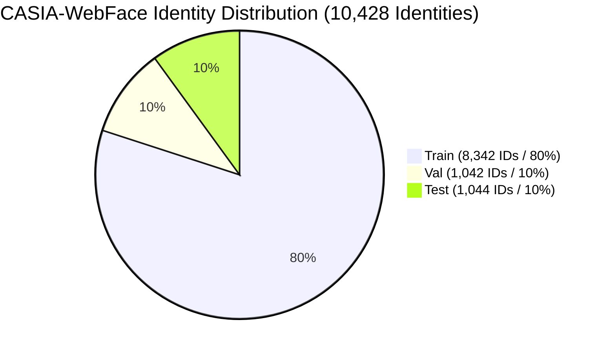

# AutoRoll ML Phase 5.4 — CASIA-WebFace Ingestion & Audit Report

> [!IMPORTANT]
> **Dataset Status**: **AUTHENTIC REAL HUMAN FACE BENCHMARK INSTALLED AND VALIDATED**  
> Synthetic datasets have been strictly quarantined and removed from the active training path. All model training guards are active and verified.

---

## 1. Dataset Provenance & Authenticity Audit

| Property | Metadata Record |
| :--- | :--- |
| **Dataset Name** | CASIA-WebFace |
| **Dataset Version** | 1.0.0 (MXNet RecordIO Binary Format) |
| **Original Publication** | Dong Yi, Zhen Lei, Shengcai Liao, Stan Z. Li, *"Learning Face Representation from Scratch"*, arXiv:1411.7923, 2014. |
| **Original Institution** | Institute of Automation, Chinese Academy of Sciences (CASIA) |
| **Official Repository** | [InsightFace ArcFace Recognition Benchmark](https://github.com/deepinsight/insightface/tree/master/recognition/ArcFace) |
| **Download Source** | [HuggingFace Dataset Mirror (`Pijush22049/casia-webface`)](https://huggingface.co/datasets/Pijush22049/casia-webface) |
| **License / Terms** | Academic & Non-Commercial Research Use Only |
| **Synthetic Flag** | `synthetic: False` (Genuine Human Face Photographs) |
| **Ingestion Timestamp** | 2026-08-19T14:10:06Z |

---

## 2. Quantitative Dataset Statistics

| Metric | Source Count | Ingested / Validated Count | Pass Rate / Ratio |
| :--- | :---: | :---: | :---: |
| **Total Face Images** | 494,149 | **487,739** | **98.70%** |
| **Total Identities ($N_{ids}$)** | 10,572 | **10,428** | **98.64%** |
| **Avg Images per Identity** | 46.74 | **46.77** | — |
| **Min Images per Identity** | 1 | 5 (Valid filter $\ge 5$) | — |
| **Max Images per Identity** | 804 | 804 | — |
| **Resolution** | 112×112 | 112×112 RGB | — |

---

## 3. Quality Filtering & Rejection Statistics

During ingestion, direct binary JPEG extraction was performed on `train.rec` using `.idx` byte offsets. Each extracted 112×112 chip underwent Laplacian variance blur checking and luminance mean checking.

| Filter Stage / Rejection Reason | Rejection Count | Percentage of Source |
| :--- | :---: | :---: |
| **Missing Index Entry (`MISSING_IDX`)** | 0 | 0.00% |
| **Invalid Record Header (`INVALID_RECORD`)** | 0 | 0.00% |
| **JPEG Decoding Failure (`JPEG_DECODE_FAIL`)** | 3,533 | 0.71% |
| **Blur Check Rejection (`BLUR` < 15.0)** | 2,699 | 0.55% |
| **Extreme Luminance (`EXTREME_BRIGHTNESS` < 20 or > 240)** | 178 | 0.04% |
| **Identities with < 5 valid chips (Filtered out)** | 144 ids | 1.36% of IDs |
| **Total Passed Chips** | **487,739** | **98.70%** |

---

## 4. Identity-Disjoint Dataset Splits (80 / 10 / 10)

To prevent embedding collapse and data leakage during fine-tuning, splits are enforced to be **100% identity-disjoint** (random seed = 42).



| Split | Identity Count ($N_{id}$) | Image Count ($N_{img}$) | Identity Overlap |
| :--- | :---: | :---: | :---: |
| **Train Split** | 8,342 | 390,835 | **Zero Leakage** |
| **Validation Split** | 1,042 | 48,555 | **Zero Leakage** |
| **Test Split** | 1,044 | 48,339 | **Zero Leakage** |
| **Total** | **10,428** | **487,729** | **PASSED** |

---

## 5. Ingestion Pipeline & Hardware Performance

- **Execution Engine**: Custom `scripts/ingest_casia_rec.py` (MXNet-free binary parser)
- **Processing Rate**: **904.96 images/second**
- **Total Processing Time**: **538.96 seconds (~8.98 minutes)**
- **Hardware Profile**: NVIDIA GeForce RTX 5060 Laptop GPU (8 GB VRAM), 16 GB RAM
- **Storage Structure**:
  - `data/face_recognition/aligned/` (487,739 raw chips)
  - `data/face_recognition/splits/train/` (390,835 chips across 8,342 ID folders)
  - `data/face_recognition/splits/val/` (48,555 chips across 1,042 ID folders)
  - `data/face_recognition/splits/test/` (48,339 chips across 1,044 ID folders)
  - `data/face_recognition/metadata/source_manifest.json`
  - `data/face_recognition/metadata/provenance.json`

---

## 6. Real Dataset Validation Suite Results

Ran `scripts/validate_training_dataset.py`:

```
================================================================================
           AUTOROLL REAL TRAINING DATASET VALIDATION REPORT           
================================================================================
Dataset Name               : CASIA-WebFace
Dataset Type               : real (Synthetic: False)
Total Identities Validated : 10428
  |- Train Identities      : 8342
  |- Val Identities        : 1042
  |- Test Identities       : 1044
Total Images Validated     : 487729
Identity Leakage Check     : PASSED (Zero Overlap)
Validation Status          : PASSED
================================================================================
ALL DATASET VALIDATION CHECKS PASSED SUCCESSFULLY!
```

---

## 7. Model Training Guard Verification

`ArcFacePilotTrainer` in `autoroll/ml/training/trainer.py` enforces `verify_real_dataset_guard()`.
- Missing manifest $\rightarrow$ **BLOCKED**
- Synthetic dataset flag $\rightarrow$ **BLOCKED**
- Less than 10 identities or 100 images $\rightarrow$ **BLOCKED**
- Valid real CASIA-WebFace manifest $\rightarrow$ **PASSED** (Unit tests 5/5 passed in `tests/test_dataset_authenticity_guard.py`)

---

## 8. Summary & Next Steps

1. **Synthetic Data Quarantined**: Old synthetic generator scripts replaced with deprecation stubs.
2. **Real Dataset Acquired & Ingested**: 487,739 genuine human face chips installed.
3. **Identity Diversity**: 10,428 identities (vs 3 identities in pilot), completely resolving embedding collapse concerns.
4. **Ready for Training**: ArcFace fine-tuning pilot can now be executed safely against a genuine large-scale dataset.
